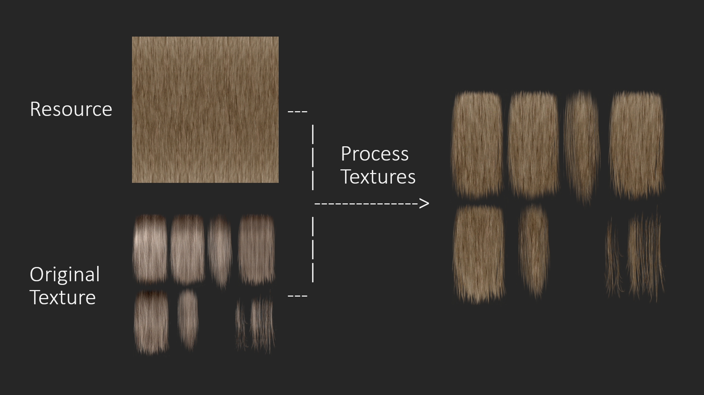

# Hair Texture Creator

GIMP Python plugins that facilitate and automatise the creation of DDS texture files using pre-made resources.

## Features

These folders contain several Python scripts and plugins that I wrote to create and update my mod [Salt and Wind - KS Hairdos - Update](https://www.nexusmods.com/skyrimspecialedition/mods/64707). They provide functionalities that help create new hair textures using pre-made resources in [GIMP](https://www.gimp.org/), an open-source image editor and 2D asset creation tool.

The goal of these scripts and plugins is to automatise tedious tasks such as transferring alpha masks between layers and exporting the textures to DDS.

### GIMP 2.10 (Legacy)

This folder contains the original scripts that I wrote in 2022 for GIMP 2.10, the latest GIMP version at the time. They are feature-complete, and no more updates will be issued.

### GIMP 3.0

This folder contains a new and updated plugin for GIMP 3.0 based on the original 2.10 scripts. This is the current version that I am actively maintaining. You can expect updates to this version.

## Resources

Resources that I use(d) for [Salt and Wind - KS Hairdos - Update](https://www.nexusmods.com/skyrimspecialedition/mods/64707):

- [KS Hairdos diffuse textures](https://www.nexusmods.com/skyrimspecialedition/mods/6817)
- [Edited Salt and Wind texture named "4x squishh.dds"](https://www.nexusmods.com/skyrimspecialedition/mods/45147?tab=files)

## License & Credits

All my scripts and plugins are published under the GPL 3.0 license, so you can do with them what you want. If you release a mod that was created using my scripts, please credit me in the mod description page (link to [my website](https://dovaya.github.io)) and provide a link back to [this repo](https://github.com/dovaya/hair-texture-creator) such that other people can find the resources.

If you have questions, contact me (preferably) via [NexusMods](https://next.nexusmods.com/profile/dovaya). Check [my website](https://dovaya.github.io) for more details about my mods or other forms of contacting me.

Happy modding!
