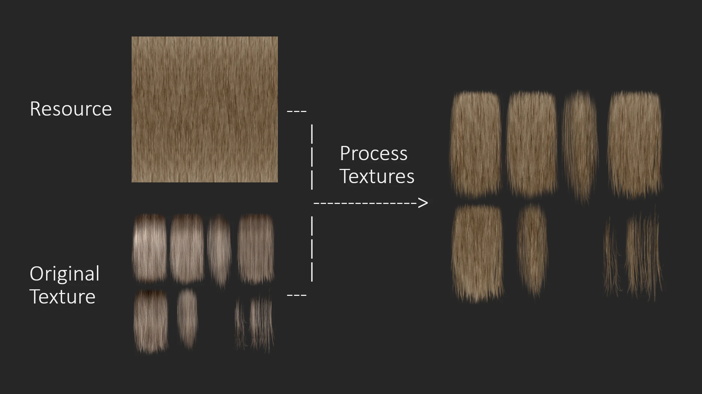

# Hair Texture Creator: GIMP 2.10 Version (Legacy)

This folder contains several scripts that I wrote in 2022 for GIMP 2.10 to create my mod [Salt and Wind - KS Hairdos - Update](https://www.nexusmods.com/skyrimspecialedition/mods/64707). They provide functionalities that help create new hair textures using pre-made resources. The goal is to automatise tedious tasks such as transferring alpha masks between layers and exporting the textures to DDS and PNG.

Resources that I use(d) for [Salt and Wind - KS Hairdos - Update](https://www.nexusmods.com/skyrimspecialedition/mods/64707):

- [KS Hairdos diffuse textures](https://www.nexusmods.com/skyrimspecialedition/mods/6817)
- [Edited Salt and Wind texture named "4x squishh.dds"](https://www.nexusmods.com/skyrimspecialedition/mods/45147?tab=files)

## Installation

1. Install [GIMP 2.10](https://www.gimp.org/). Make sure it runs correctly.
2. Clone this repo.
3. Move the Python scripts in the `gimp-2.10` folder into the `plug-ins` folder of your GIMP instance.
   - On Windows: `C:/Users/[YourUsername]/AppData/Roaming/GIMP/2.10/plug-ins`
   - On Linux: `/home/[YourUsername]/.config/GIMP/2.10/plug-ins`
4. Start GIMP.
5. Under `Tools`, check if there is a submenu called `dovaya`.
   - If yes, then you installed the scripts correctly.
   - If no, there was an issue. Please try again.

## Usage

I suggest that you just try the scripts out, they are rather simple and easy to use and understand. However, here I will provide some additional info for the more complicated scripts.

### Dovaya_SaltAndWind_CreateHairTextures.py

This script automatically creates new textures using a resource file that provides the texture itself and original textures that provide the alpha masks.

1. Create a folder with all the original hair textures you want to replace.
   - Be aware that these files will be overwritten, so make sure you keep copies.
2. Start the plug-in by clicking on `Tools > dovaya > Create hair textures`.
3. Specify the folder with the original hair textures and specify the hair resource texture.
   - Furthermore, specify whether you want to export the textures directly (as DDS and/or PNG), and the logs location.
4. Start the process by clicking `Ok`.

The script will now automatically load all the original hair textures as well as the hair resource and transfer the alpha mask. It will save each texture as an XCF file and (if specified) export it.

For a lot of textures, this will be enough, namely when all the hair texture parts align with the used hair texture (when the hair flows in the same direction).

In case some parts are misaligned, create a rotated version of your hair resource texture and use it with the `Dovaya_SaltAndWind_TransferSelectionToNewResource.py` or `Dovaya_SaltAndWind_TransferAlphaMask.py` to make your specified selection or the whole texture transfer its alpha mask to the new, rotated texture.

### Dovaya_SaltAndWind_TransferAlphaMask.py

Either select the part of your original texture you want to transfer or leave the selection empty. Transfer the alpha mask of one layer to another.

### Dovaya_SaltAndWind_TransferSelectionToNewResource.py

Select the part of the original texture whose alpha mask you want to transfer to the newly loaded texture. I mainly used it to transfer certain parts of the original texture to a rotated texture.

## License & Credits

All my scripts and plugins are published under the GPL 3.0 license, so you can do with them what you want. If you release a mod that was created using my scripts, please credit me in the mod description page (link to [my website](https://dovaya.github.io)) and provide a link back to [this repo](https://github.com/dovaya/hair-texture-creator) such that other people can find the resources.

If you have questions, contact me (preferably) via [NexusMods](https://next.nexusmods.com/profile/dovaya). Check [my website](https://dovaya.github.io) for more details about my mods or other forms of contacting me.

Happy modding!
