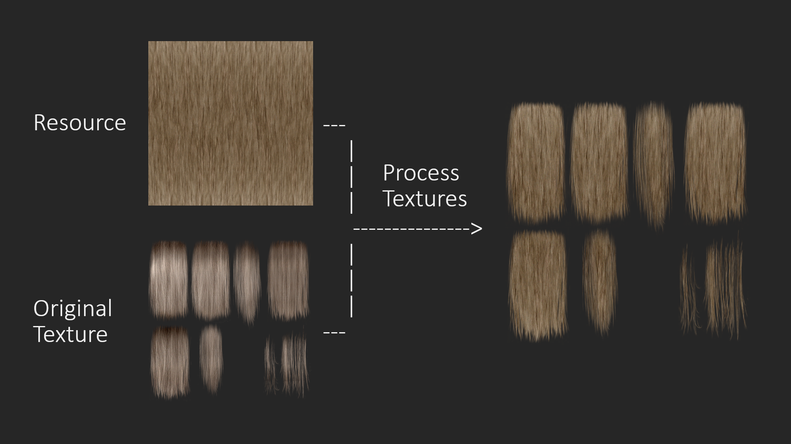

# Hair Texture Creator: GIMP 3.0 Version

This folder contains a plugin that I wrote in 2025 for GIMP 3.0 to update my mod [Salt and Wind - KS Hairdos - Update](https://www.nexusmods.com/skyrimspecialedition/mods/64707). It provides functionalities that help create new hair textures using pre-made resources. The goal is to automatise tedious tasks such as transferring alpha masks between layers and exporting the textures to DDS.

Resources that I use(d) for [Salt and Wind - KS Hairdos - Update](https://www.nexusmods.com/skyrimspecialedition/mods/64707):

- [KS Hairdos diffuse textures](https://www.nexusmods.com/skyrimspecialedition/mods/6817)
- [Edited Salt and Wind texture named "4x squishh.dds"](https://www.nexusmods.com/skyrimspecialedition/mods/45147?tab=files)

## Installation

1. Install [GIMP 3.0](https://www.gimp.org/). Make sure it runs correctly.
2. Clone this repo.
3. Move the folder `dovaya-hair-texture-creator` in the `gimp-3.0` folder into the `plug-ins` folder of your GIMP instance.
   - On Windows: `C:/Users/[YourUsername]/AppData/Roaming/GIMP/3.0/plug-ins`
   - On Linux: `/home/[YourUsername]/.config/GIMP/3.0/plug-ins`
4. Start GIMP.
5. Under `Tools`, check if there is a submenu called `dovaya`.
   - If yes, then you installed the plugin correctly.
   - If no, there was an issue. Please try again.

## Usage

The plugin currently has two functionalities.

### Process Textures

This procedure transfers all the alpha masks of textures in a chosen folder to a new texture resource. It automatically creates new textures using a resource file that provides the texture itself and original textures that provide the alpha masks.

1. Load the texture resource you want to use (like the [Edited Salt and Wind texture named "4x squishh.dds"](https://www.nexusmods.com/skyrimspecialedition/mods/45147?tab=files)).
2. Navigate to `Tools > dovaya > Process Textures`. Click on `Process Textures`.
3. In the pop up, choose the folder that contains all the original textures whose alpha masks should be applied to the resource as the `Textures` option.
   - Be aware that these files will be overwritten, so make sure you keep copies.
4. Start the process by clicking `Ok`.

The script will now automatically load each original texture, transfer its alpha layer mask to the new resource, save the image as a XCF file and export the resulting edited texture back as a DDS file. Only textures that have the same width and height as the resource texture will be processed.

For a lot of textures, this will be enough, namely when all the hair texture parts align with the used hair texture (when the hair flows in the same direction).

In case some parts are misaligned, create a rotated version of your hair resource texture and use it with the `Transfer Alpha` option to make your specified selection or the whole texture transfer its alpha mask to the new, rotated texture.

### Transfer Alpha

This procedure transfers the alpha mask of a specified layer to another layer in the same image. Optionally, you can transfer only a selection of the original texture's alpha mask.

1. Load the texture resource you want to use (like the [Edited Salt and Wind texture named "4x squishh.dds"](https://www.nexusmods.com/skyrimspecialedition/mods/45147?tab=files)).
2. Load the original texture whose alpha mask you want to use as another layer.
3. (Optional) Create a selection of the part of the image whose alpha mask you want to transfer.
4. Navigate to `Tools > dovaya > Transfer Alpha`. Click on `Transfer Alpha`.
5. In the pop up, choose the layer whose alpha mask you want to transfer as the `Alpha Layer`, and choose the resource layer as the `Resource Layer`.
6. (Optional) Tick the checkbox `Use Selection` if you have selected only a part of the image.
7. Start the process by clicking `Ok`.

This process is non-destructive. The original texture layer will remain intact, and the resource layer will be copied. The alpha mask of the original texture will then be applied to the copy of the resource layer.

## License & Credits

All my scripts and plugins are published under the GPL 3.0 license, so you can do with them what you want. If you release a mod that was created using my scripts, please credit me in the mod description page (link to [my website](https://dovaya.github.io)) and provide a link back to [this repo](https://github.com/dovaya/hair-texture-creator) such that other people can find the resources.

If you have questions, contact me (preferably) via [NexusMods](https://next.nexusmods.com/profile/dovaya). Check [my website](https://dovaya.github.io) for more details about my mods or other forms of contacting me.

Happy modding!
